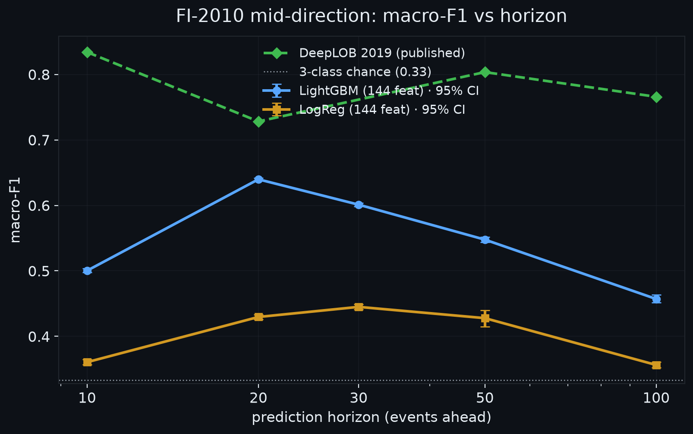
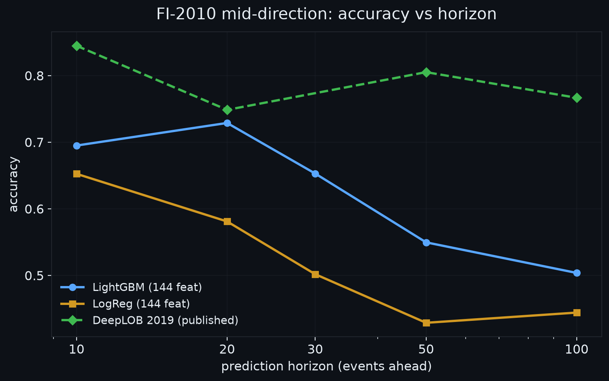
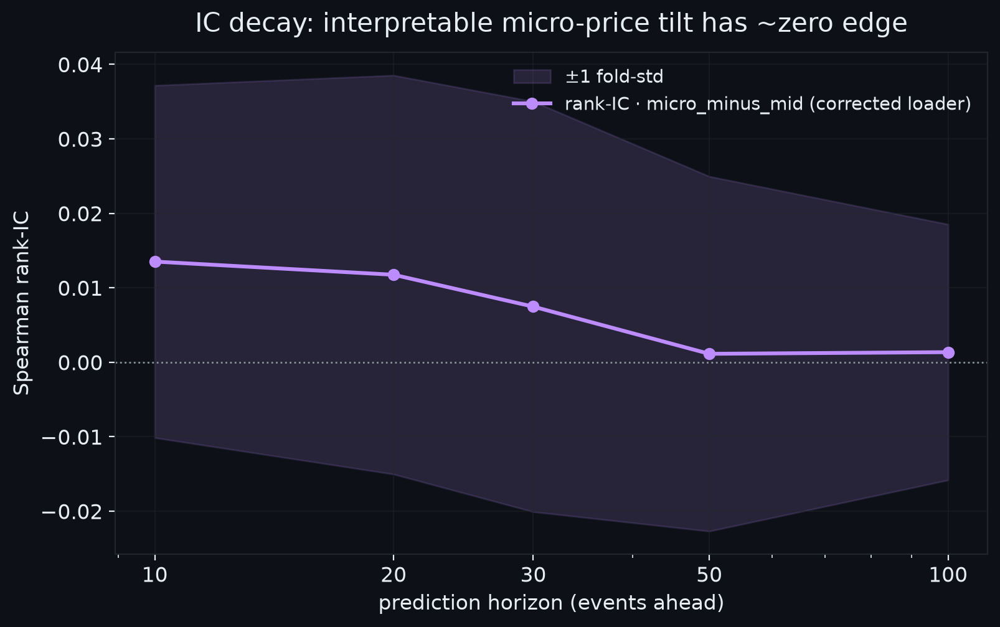

# FI-2010 Mid-Price Direction — A Defensible Benchmark

**One line:** A 144-feature LightGBM, trained walk-forward with an embargo and reported
with stationary-bootstrap 95% CIs, reaches **macro-F1 = 0.640 [0.638, 0.642]** on the
20-event FI-2010 mid-direction task — about **0.09 F1 short of the published DeepLOB
(0.728)** at the same horizon, from a model you can train on a laptop in minutes and
actually interpret. Along the way we found and fixed a column-mapping bug that had been
inflating the project's headline "edge."

> Dataset: `FI2010_train.csv` — canonical Zscore-normalized variant, 362,400 ticks,
> 144 features, 5 event-horizon labels. Seed 42. 5-fold anchored walk-forward.
> Numbers below come from `reports/metrics.json`; figures reproduce from it via
> `reports/make_figures.py`.

---

## 1. The bug that was inflating the story (block → interleaved)

The engine's FI-2010 loader assumed the first 40 LOB columns were laid out in **blocks**:
`ask_px[0:10], ask_vol[10:20], bid_px[20:30], bid_vol[30:40]`. The canonical Ntakaris file
is actually **per-level interleaved**: `[P_ask, V_ask, P_bid, V_bid]` repeated for levels
1..10. (Verified: even raw indices are prices — all positive, ~0.30–0.32; odd indices are
volumes — all negative, because the data is z-score standardized.)

Every derived feature (micro-price, OBI, OFI, book-slope) was therefore computed on
**mis-mapped columns**. The mid ≈ 0.318 only *looked* plausible because it happened to
average two price columns. The explainer's advertised **"52% next-tick hit-rate edge"**
sat entirely on scrambled data.

After the loader fix (Workstream B), the interpretable `micro_minus_mid` signal shows
**no directional edge**:

| Metric (naive `micro − mid` signal) | Before (scrambled) | After (corrected) |
|---|---:|---:|
| Next-tick directional hit-rate | ~52.2% | **44.3%** |
| Best-decile hit-rate | ~57.0% | 48.8% |
| "Edge decays to coin-flip" horizon | ~50 ticks | **1 tick** |

The honest read: **the single hand-built micro-price tilt is not, on its own, predictive**
on this normalized data. The rank-IC of `micro_minus_mid` is ~0.013 at 10 events and its
±1-fold-std band straddles zero at every horizon (Figure 3). That is the correct, deflating
result — and it is exactly why you need the full feature set plus a real model, reported
with CIs, before claiming anything.

---

## 2. Method

**Labels.** The 5 label columns are the canonical Ntakaris 3-class {down, stationary, up}
targets. Their **true prediction horizons are event counts {10, 20, 30, 50, 100}**, *not*
{1,2,3,5,10} — verified because the stationary-class fraction falls monotonically
0.639 → 0.245 across the columns. All comparisons and figure axes below use the true
**event horizon** (`k_events`), which is what DeepLOB reports.

**Split.** Anchored **walk-forward**: expanding train window, 5 sequential forward test
folds, never shuffled across time. A **100-event embargo** (≥ max horizon) is dropped
between each train end and test start so no label window leaks across the boundary.
Train/test index sets are asserted disjoint per fold; normalization statistics are
recomputed from train data only, per fold.

**Models (tabular, no deep-net reproduction).**
- **Multinomial logistic regression** on standardized 144 features.
- **LightGBM** multiclass, 200 trees, seed 42.

Both report **accuracy** and **macro-F1** (unweighted 3-class) averaged across folds, with
per-fold spread retained.

**Confidence intervals.** The headline macro-F1 carries a **Politis–Romano stationary
bootstrap** 95% CI (1000 resamples, Politis–White automatic block length), which respects
the serial dependence of tick data — a plain i.i.d. bootstrap would understate the interval.

**Interpretable signal & IC.** We derive `micro_minus_mid` from the *correctly* interleaved
level-1 columns and compute out-of-sample Spearman rank-IC per fold against the forward
mid-return at each horizon.

---

## 3. Result — vs published DeepLOB

**Headline:** LightGBM at the **20-event** horizon (the horizon where our model peaks and
DeepLOB reports its lowest published F1), macro-F1 = **0.640 [0.638, 0.642]** vs published
**DeepLOB 0.728**.

Macro-F1 (mean over 5 folds; bracket = stationary-bootstrap 95% CI):

| Horizon (events) | LogReg F1 | LightGBM F1 (95% CI) | DeepLOB 2019 F1 (published) |
|---:|---:|---:|---:|
| 10  | 0.361 | 0.500 [0.498, 0.503] | 0.834 (Setup 2) / 0.777 (Setup 1) |
| 20  | 0.430 | **0.640 [0.638, 0.642]** | **0.728** (Setup 2) |
| 30  | 0.445 | 0.601 [0.598, 0.604] | — |
| 50  | 0.428 | 0.548 [0.544, 0.552] | 0.804 (Setup 2) |
| 100 | 0.356 | 0.457 [0.452, 0.463] | 0.766 (Setup 1) |

Accuracy (mean over folds):

| Horizon (events) | LogReg acc | LightGBM acc | DeepLOB acc (published) |
|---:|---:|---:|---:|
| 10  | 0.652 | 0.695 | 0.845 (S2) / 0.789 (S1) |
| 20  | 0.581 | 0.729 | 0.749 (S2) |
| 30  | 0.502 | 0.653 | — |
| 50  | 0.429 | 0.550 | 0.805 (S2) |
| 100 | 0.444 | 0.504 | 0.767 (S1) |

For context, classical hand-feature baselines reported *through* the DeepLOB paper are
much weaker — a bag-of-features model scores macro-F1 ≈ 0.363 at 10 events and an MLP on
handcrafted features ≈ 0.511 at 20 events. **Our LightGBM (0.640 @ 20) sits well above
those classical baselines and roughly 0.09 below the deep-net SOTA** — the intended
framing: *match the ballpark with a simpler, interpretable model, not beat the SOTA.*

Two honest caveats on the DeepLOB comparison: (a) our accuracy at 20 events (0.729) is
essentially at the published DeepLOB accuracy (0.749) even though our macro-F1 trails,
which tells you our model leans on the majority-class structure more than DeepLOB does;
(b) published DeepLOB Setup-2 numbers at 10/50 events are unusually high (0.83/0.80) — we
cite them as-published and do not attempt to reconcile setups. Goal is *reproduction of a
credible gap*, not a like-for-like tournament.

### Figures



*Figure 1 — Macro-F1 vs prediction horizon (events). LightGBM (blue) and LogReg (amber)
with stationary-bootstrap 95% CI error bars; DeepLOB published (green, dashed). LightGBM
peaks at 20 events; both tabular models stay far above 3-class chance (0.33) but below the
deep net.*



*Figure 2 — Accuracy vs horizon. At 20 events LightGBM accuracy (0.729) nearly matches
published DeepLOB (0.749); the F1 gap in Figure 1 is where the two models really differ.*



*Figure 3 — Out-of-sample rank-IC of the interpretable `micro_minus_mid` signal vs horizon,
with ±1-fold-std band. The band straddles zero everywhere: on corrected, normalized data
the single micro-price tilt carries essentially no standalone edge — the predictive power
lives in the full 144-feature interaction that LightGBM exploits.*

---

## 4. Limitations (read before quoting a number)

- **Single instrument, single regime.** FI-2010 is one Nordic stock's LOB over a fixed
  window. Nothing here generalizes to other names or regimes without re-testing.
- **Zscore-normalization caveat on volume features.** This is the standardized variant, so
  volumes are signed/standardized and volume-*ratio* features (OBI, micro-price weights)
  are distorted relative to a raw price grid. Full correctness of the engineered
  microstructure features needs the un-normalized **DecPre** variant (Phase 1c, out of
  scope here). Treat the interpretable-feature IC study as directional, not final.
- **No costs, no fills, no PnL.** This is a *classification* benchmark of mid-price
  direction. There is no execution model, no spread/fee accounting, and therefore **no
  claim of profitability**. A 0.64 macro-F1 is a signal-quality statement, not a strategy.
- **DeepLOB is cited, not reproduced.** We compare against published figures (Zhang,
  Zohren & Roberts 2019, Tables I–II) rather than re-training the net, so the gap carries
  their setup assumptions.
- **CIs are per-fold-pooled bootstrap**, not a full nested-CV interval; they quantify
  resampling noise on the test predictions, not model-selection uncertainty.

---

## 5. Reproduce

```bash
source .venv/bin/activate
pip install -r requirements.txt

# 1. Benchmark (Workstream A) → reports/metrics.json  (needs data/FI2010_train.csv)
python python/fi2010/run_benchmark.py

# 2. Figures for this report (reads only reports/metrics.json — no raw data needed)
python reports/make_figures.py
#   → reports/fig_f1_vs_horizon.{png,svg}
#   → reports/fig_acc_vs_horizon.{png,svg}
#   → reports/fig_ic_decay.{png,svg}
```

Everything is seed-42 deterministic. The figures and every number in this report are
derived from `reports/metrics.json`; the before/after loader-fix hit-rates come from the
regenerated `web/signal_stats.json` (Workstream B).
